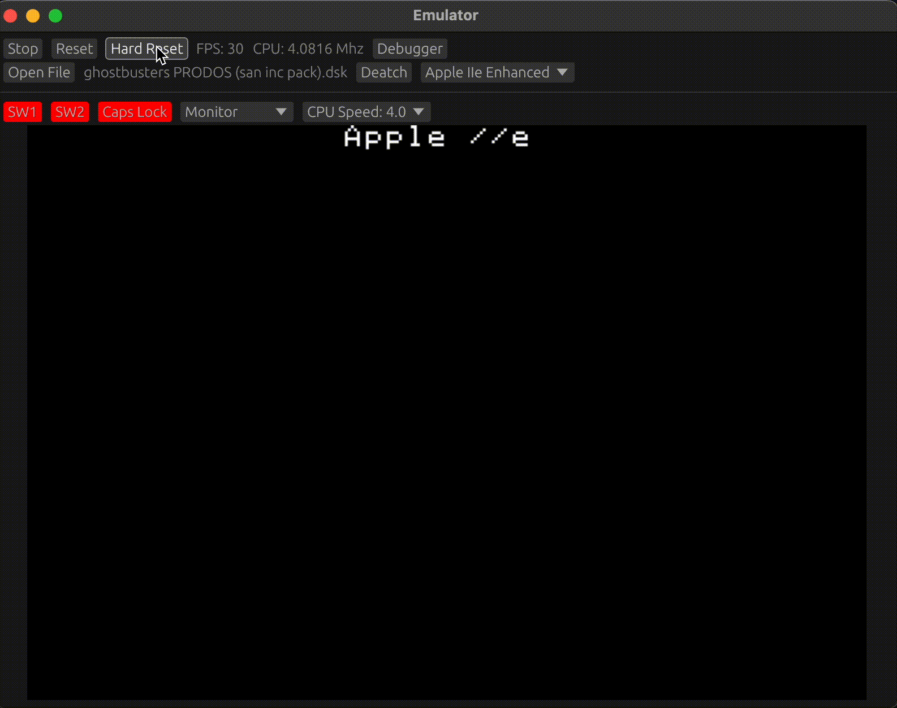

# emu

`emu` is a general purpose, cross-platform emulator built in Rust. It is compatible with Mac OS, Windows, Linux, and web (via WASM). 

Try it in your browser at [https://emu.chrismoos.com](https://emu.chrismoos.com)



## Supported Machines

Currently the emulator only supports Apple II (and it's variants). I'm hoping to add C64 support next.

The MOS 6502 processor is cycle accurate (or at least as close as possible given the emulator host environment). It passes the [Klaus Dormann functional tests](https://github.com/Klaus2m5/6502_65C02_functional_tests/tree/master).

## Architecture

`emu` uses the immediate-mode [egui](https://github.com/emilk/egui) library for video display and input, and [cpal](https://github.com/RustAudio/cpal) for audio.

## Download

Pre-built binaries for macOS, Linux, and Windows are available on the [releases page](https://github.com/chrismoos/emu/releases).

## Building from source

All platforms require [Rust](https://rustup.rs/) and [cc65](https://cc65.github.io/) (6502 cross-assembler for building Apple II firmware).

**Linux (Debian/Ubuntu):**

```bash
curl --proto '=https' --tlsv1.2 -sSf https://sh.rustup.rs | sh
. "$HOME/.cargo/env"
sudo apt-get install build-essential pkg-config cc65 libudev-dev libasound2-dev libxkbcommon-x11-0
git clone https://github.com/chrismoos/emu && cd emu
cargo run --release
```

**macOS:**

```bash
brew install cc65
git clone https://github.com/chrismoos/emu && cd emu
cargo run --release
```

**Windows:**

Install [Rust](https://rustup.rs/) and [cc65](https://cc65.github.io/), ensuring both are in your `PATH`.

```bash
git clone https://github.com/chrismoos/emu && cd emu
cargo run --release
```

**WASM:**

```bash
trunk serve --features=wasm --no-default-features --release
```

## Apple II

The following Apple II machines are supported:

* Apple II
* Apple II+
* Apple IIe (unenhanced)
* Apple IIe (enhanced, WDC65C02 processor)

The [a2audit](https://github.com/zellyn/a2audit/tree/main) tests are passing for all supported machines.

### Supported ROM files

* .dsk
* .po
* .woz
* .hdv

### Peripherals and I/O

* Apple Disk ][
* Video (lores, hires, mixed mode, double hires, Video7 black and white)
* Mouse (limited, BASIC support still in progress)
* Audio
* Language Card
* Extended 80-column Text Card
* Smartport (rudimentary support, allows for loading .hdv)
* Super Serial Card

### Super Serial Card

The emulator includes a full implementation of the Apple II Super Serial Card in slot 1. The card emulates the 6551 ACIA (Asynchronous Communications Interface Adapter) with support for configurable baud rates (50-19200), data bits (5-8), parity modes, and interrupt-driven I/O.

#### Serial Device Selection

On native targets (desktop), you can connect the Super Serial Card to either a physical serial port or the built-in Internet Modem:

```bash
# Use a physical serial port
cargo run --release -- --serial-port /dev/ttyUSB0

# Use the Internet Modem (default when no --serial-port is specified)
cargo run --release
```

The `--serial-force-zero-baud` flag can be used when testing with local `socat` bridges that don't require baud rate configuration.

#### Internet Modem (Default)

When no physical serial port is specified, the Super Serial Card connects to a virtual **Internet Modem**. This allows vintage Apple II terminal software (like ProTerm, Modem.MGR, etc.) to connect to modern TCP/IP services such as BBSes, MUDs, and other telnet-accessible systems.

#### AT Command Interface

The Internet Modem responds to Hayes-compatible AT commands. Characters are echoed as you type, and commands are terminated with Enter (CR or LF).

| Command | Description |
|---------|-------------|
| `ATDT <host>:<port>` | Dial (connect) to a TCP host. Initiates a TCP connection to the specified address. |

**Example Session:**

```
ATDT bbs.example.com:23
Connecting to bbs.example.com:23...
OK: Connected to bbs.example.com:23
```

Once connected, the modem enters transparent data mode where all input/output is bridged directly to the TCP connection. The connection closes when the remote host disconnects or when DTR is disabled by the Apple II software.